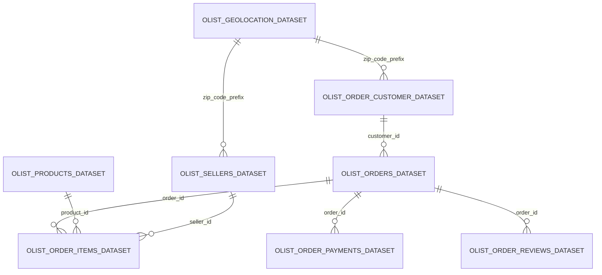

# About Dataset

## Brazilian E-Commerce Public Dataset by Olist
Welcome! This is a Brazilian ecommerce public dataset of orders made at Olist Store. The dataset has information of 100k orders from 2016 to 2018 made at multiple marketplaces in Brazil. Its features allows viewing an order from multiple dimensions: from order status, price, payment and freight performance to customer location, product attributes and finally reviews written by customers. We also released a geolocation dataset that relates Brazilian zip codes to lat/lng coordinates.

This is real commercial data, it has been anonymised, and references to the companies and partners in the review text have been replaced with the names of Game of Thrones great houses.

## Join it With the Marketing Funnel by Olist
We have also released a Marketing Funnel Dataset. You may join both datasets and see an order from Marketing perspective now!

Instructions on joining are available on this Kernel.

## Context
This dataset was generously provided by Olist, the largest department store in Brazilian marketplaces. Olist connects small businesses from all over Brazil to channels without hassle and with a single contract. Those merchants are able to sell their products through the Olist Store and ship them directly to the customers using Olist logistics partners. See more on our website: www.olist.com

After a customer purchases the product from Olist Store a seller gets notified to fulfill that order. Once the customer receives the product, or the estimated delivery date is due, the customer gets a satisfaction survey by email where he can give a note for the purchase experience and write down some comments.

## Attention
1. An order might have multiple items.
1. Each item might be fulfilled by a distinct seller.
1. All text identifying stores and partners where replaced by the names of Game of Thrones great houses.

## Data Schema
The data is divided in multiple datasets for better understanding and organization. Please refer to the following data schema when working with it:

## Inspiration
Here are some inspiration for possible outcomes from this dataset.

NLP:

This dataset offers a supreme environment to parse out the reviews text through its multiple dimensions.

Clustering:

Some customers didn't write a review. But why are they happy or mad?

Sales Prediction:

With purchase date information you'll be able to predict future sales.

Delivery Performance:

You will also be able to work through delivery performance and find ways to optimize delivery times.

Product Quality:

Enjoy yourself discovering the products categories that are more prone to customer insatisfaction.

Feature Engineering:

Create features from this rich dataset or attach some external public information to it.
